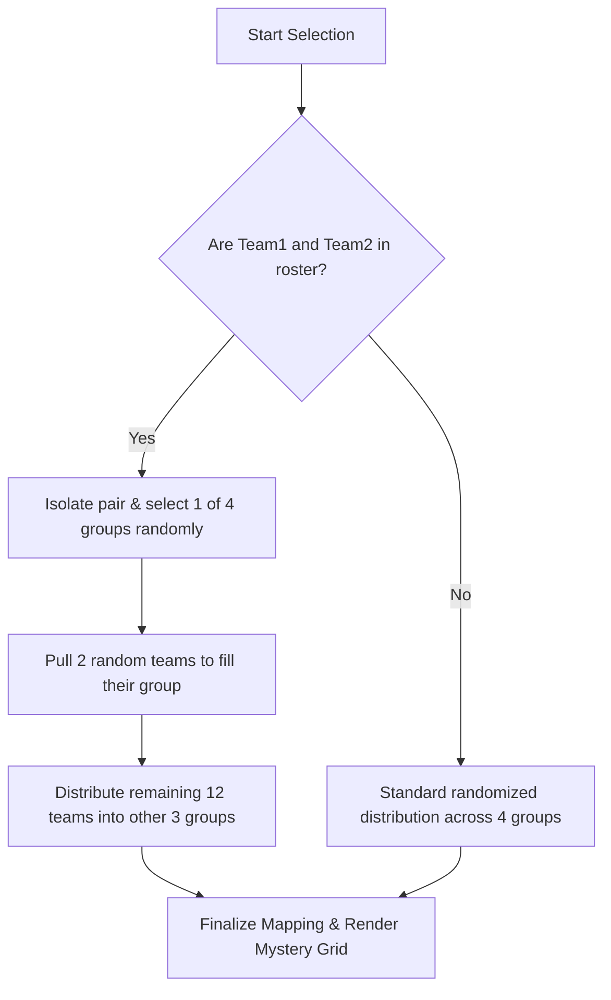

# 🎯 Exodus Team Randomizer — Mystery Selection Edition (v4.2)

[](https://react.dev/)
[](https://vite.dev/)
[](https://lucide.dev/)
[](https://opensource.org/licenses/MIT)

An ultra-sleek, high-fidelity React + Vite web application custom-built for the **EXODUS Hack-Jam 2026** to randomize and partition 16 competitor teams into 4 groups (A, B, C, D) of 4 teams each. Featuring an interactive mystery selection interface, custom team pairing rules, and striking cinematic styling.

---

## ✨ Features

*   **🔮 Interactive Mystery Draw:** Instead of a basic list shuffle, teams select their group by choosing from 4 interactive mystery boxes featuring cinematic reveal animations.
*   **⛓️ Pair Sync Protocol (Smart Constraint):** Special algorithmic logic guarantees that specific rival/partner teams (**"Team1"** and **"Team2"**) are placed in the same group, for example here take (**"Syntax"** and **"Techmates"**), while all other assignments remain perfectly randomized. This protocol can be dynamically enabled or disabled via a visual toggle switch in the UI.
*   **⚡ Two Modes of Execution:**
    *   *Interactive Selection:* Step-by-step selection for live projection and high suspense.
    *   *Instant Result:* Instantaneous calculations and immediate final groupings.
*   **🎨 Premium Glassmorphic Design:** A gorgeous gold-on-crimson aesthetics system featuring:
    *   Dynamic background ambient glow blobs.
    *   Fully fluid transition animations (`slide-up`, `fade-in`, `zoom-in`).
    *   A clean, projector-friendly Fullscreen Mode.
*   **🎊 Celebration Integration:** Automatic full-screen confetti rain upon draft completion using `canvas-confetti`.

---

## 🛠️ Tech Stack

*   **Framework:** [React 19](https://react.dev/) (Functional components with Hooks)
*   **Build Tool:** [Vite 7](https://vite.dev/)
*   **Icons:** [Lucide React](https://lucide.dev/)
*   **Third-Party Libraries (CDN-loaded):**
    *   `canvas-confetti` (for celebration effects)
    *   `html2canvas` (for results capture)

---

## 🧠 Algorithmic Logic (The Pair Sync)

The randomizer uses a custom sorting pipeline. To ensure the two special teams are always grouped together without compromising the randomness of the other groups:



### Logical Implementation:
```javascript
const pairNames = ["syntax", "techmates"];
const actualPair = pool.filter(t => pairNames.includes(t.toLowerCase()));
const others = pool.filter(t => !pairNames.includes(t.toLowerCase()));

let groups = [[], [], [], []];
const pairGrpIdx = Math.floor(Math.random() * 4); // Select random group index

if (actualPair.length === 2) {
  groups[pairGrpIdx].push(...actualPair); // Insert pair
  groups[pairGrpIdx].push(others.pop(), others.pop()); // Add 2 other random teams
  // Fill the remaining groups with 4 teams each
  for (let i = 0; i < 4; i++) {
    if (i === pairGrpIdx) continue;
    groups[i] = [others.pop(), others.pop(), others.pop(), others.pop()];
  }
}
```

---

## 🚀 Getting Started

### 📋 Prerequisites

Ensure you have **Node.js** (v18 or higher) and **npm** installed on your machine.

### 📥 Installation

1. Clone the repository:
   ```bash
   git clone https://github.com/Ajil017/Random-picker-.git
   cd Random-picker-
   ```

2. Install dependencies:
   ```bash
   npm install
   ```

### 💻 Running Locally

Start the Vite development server:
```bash
npm run dev
```
Open your browser and navigate to `http://localhost:5173` (or the port specified in your console).

### 📦 Building for Production

Compile the production-ready build:
```bash
npm run build
```
The output files will be written to the `/dist` directory.

### 🌐 Deploying to GitHub Pages

This project is configured for automated deployment to GitHub Pages. To publish it to your GitHub Pages URL:
```bash
npm run deploy
```

---

## 📂 Project Structure

```text
├── public/                 # Static assets
├── src/
│   ├── assets/             # Images and design assets
│   ├── App.css             # Main styling rules
│   ├── App.jsx             # Core app components and logic
│   ├── index.css           # Global styles
│   └── main.jsx            # React entrypoint
├── index.html              # HTML entrypoint
├── package.json            # Configuration and script definition
├── vite.config.js          # Vite custom config
└── README.md               # Documentation
```

---

## 👨‍💻 Author

Created and maintained by [Ajil017](https://github.com/Ajil017).

---

## 📄 License

This project is licensed under the MIT License - see the [LICENSE](LICENSE) file for details.
